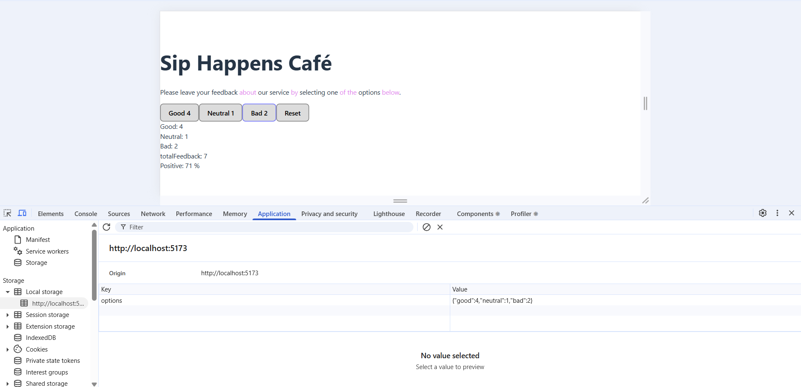

# Reviews widget

A simple widget that allows users to leave feedback as Good, Neutral, or Bad, and displays the collected reviews dynamically.

## Main feature:

- Interactive Feedback – Users can select one of three review options.
- Conditional Reset Button – The reset button appears only when there is more than one review.
- Local Storage Persistence – Reviews are saved to local storage, and the widget initializes state with stored data if available.
- Dynamic Notifications – If there are no reviews yet, a notification message is shown instead of statistics.

## Components:

- Description - Displays information about the widget.
- Options - Allows saving and displaying reviews.
- Feedback – Shows review statistics.
- Notafication– Alerts the user if no reviews are available.

